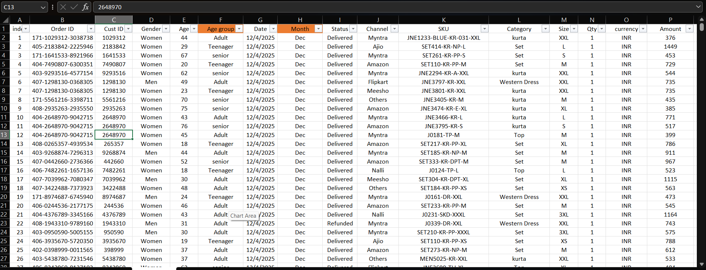

# Store Sales Analysis - My First Excel Project

## What This Project Is About

This is my first complete data analysis project. I took a full year's worth of sales data from Vrinda Store and tried to understand what's actually happening with their business.

I wanted to answer some real questions:
- When are they making the most money?
- Which platform (Amazon, Flipkart, etc.) is bringing in the most sales?
- Who's actually buying from them?
- Are orders getting delivered properly or are there issues?

## What I Used

Everything was done in Microsoft Excel. I used:
- Pivot tables to break down the data
- Charts to visualize trends
- Slicers to make the dashboard interactive
- Some data cleaning to fix messy entries

## The Data

The dataset had over 31,000 orders from a full year (January to December). Each order had info like order date, customer details, what they bought, how much they paid, which platform it came from, and whether it was delivered or not.

## What I Found Out

Here's what stood out:

**Sales Patterns:**
- March had the highest sales (₹1.9M) - probably because of festival season
- October was also strong
- Some months were surprisingly slow

**Platform Breakdown:**
- Amazon is their biggest channel - 35% of all revenue
- Flipkart comes second with 22%
- The rest is spread across other platforms

**Customer Insights:**
- Women make up 64% of customers (almost 2 out of 3 buyers)
- Most buyers are between 30-49 years old (that's half the orders)
- Maharashtra, Karnataka, and UP are the top 3 states - they account for 35% of total orders

**Order Delivery:**
- 92% orders get delivered successfully
- 3% get returned
- 5% get cancelled

## The Dashboard

I built an interactive dashboard in Excel where you can filter the data by month, platform, category, or order status. The charts update automatically based on what you select.

## What I Learned

This project taught me a lot:
- How to actually work with messy real-world data
- Pivot tables are way more powerful than I thought
- Making a dashboard that's easy to understand is harder than it looks
- The difference between just showing numbers vs. finding actual insights

## Files in This Repo

- `Vrinda Store Data Analysis.xlsx` - The main Excel file with everything
- `dashboard.png.png` - Screenshot of the dashboard
- `Order status.ong.png` - Order status breakdown chart
- `states data.png.png` - State-wise analysis

## What's Next

If I continue working on this, I'd probably:
- Compare this year's data with previous year to see growth trends
- Try to predict future sales using Python
- Look at which products are most profitable
- Maybe rebuild this in Power BI for better visualizations

---

**A bit about me:** I used to play professional cricket but had to stop due to injury last year. Now I'm teaching myself data analytics - Python, SQL, Excel, Power BI. This is my first project of many.

Feel free to connect with me on https://www.linkedin.com/in/mritunjay-chaudhary-792199353/ or check out my other work here on [GitHub](https://github.com/raghavpandiittt-sketch)
